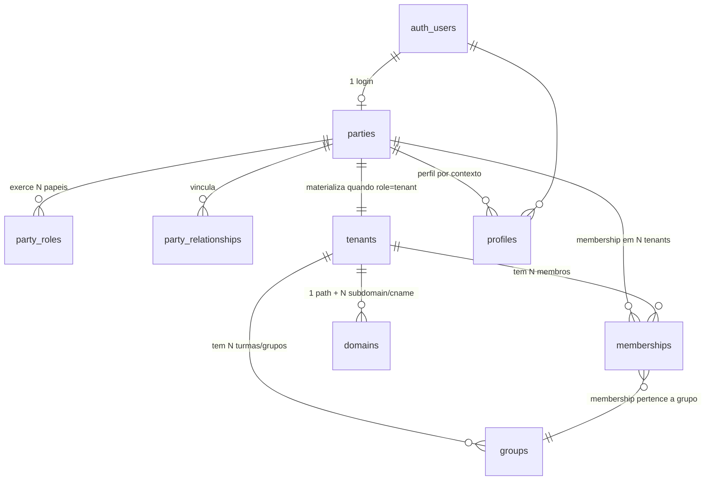
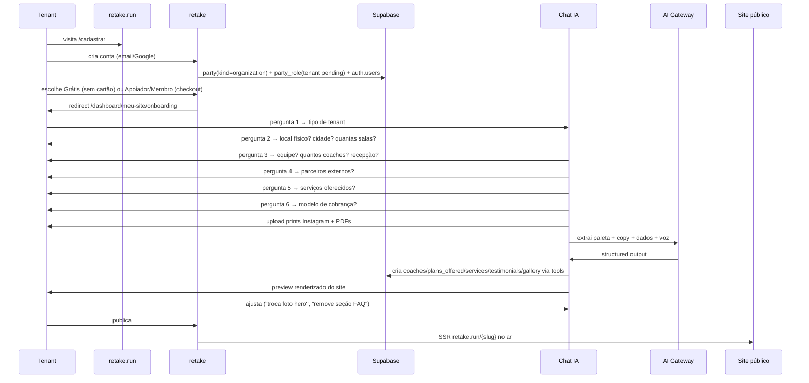
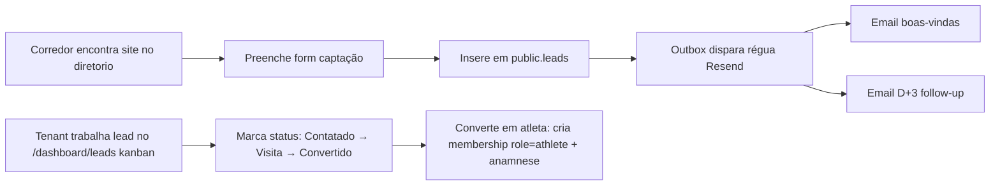
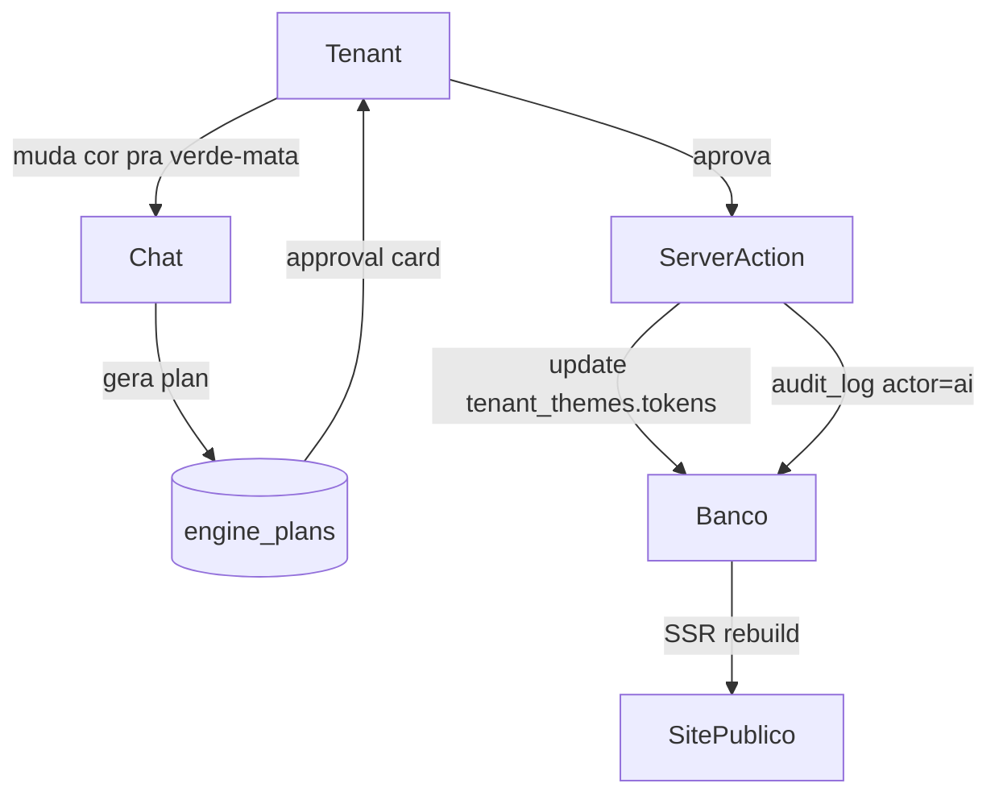

# retake.run — Founder's Bible

> **Audience: humano (fundador).** Claude consulta JIT só quando o owner pede visão geral.
> Última atualização: 2026-06-12 · Synced from ADR-0001 v1.0 · foundation.md v1.0
> Status: foundation (S0) ✅ feita. S1 ready.
>
> Este é o documento único pra entender o projeto inteiro de cabo a rabo, sem precisar abrir mais nada. Lê em ~25 minutos. Volta aqui quando quiser revisitar uma decisão.
>
> **Anti-staleness:** se você mudar ADR-0001, foundation.md ou rodar migration nova, hook bloqueia commit sem atualizar este doc. Bump "Synced from" no header.

---

## 1. Visão em 5 linhas

**retake.run é a plataforma vertical de corrida do Brasil.** Em um lugar só: o profissional (assessoria, run club ou coach autônomo) capta corredores, gerencia treino, vende, cobra, organiza eventos e se relaciona com sua comunidade. O corredor encontra quem o treina, calendário de provas e descontos. Marcas e fornecedores aparecem onde os corredores estão.

**O fosso é o núcleo de treino de corrida**: periodização (temporada → bloco → semana → sessão) → treino segmentado (aquecer/principal/recuperar/soltar com alvos de pace+FC) → loop prescrito vs executado com integração de relógios (Garmin/Strava/Polar/Coros). Isso é o que SaaS genérico de fitness não tem.

Posicionamento: especialista vertical, não generalista. **Uma marca (retake), um app (nativo único), N tenants** vivendo em `retake.run/{slug}`. Schema único `public.*` no Postgres com RLS como fronteira de segurança.

---

## 2. Os 5 públicos + monetização

### 5 públicos

| #   | Público                                                                             | Cadastro                                       | Paga?                                                     |
| --- | ----------------------------------------------------------------------------------- | ---------------------------------------------- | --------------------------------------------------------- |
| 1   | **Tenants** (assessoria / run club / coach autônomo — mesma entidade, plano define) | Self-service em `/cadastrar`                   | Sim — assinatura tenant                                   |
| 2   | **Atletas** (corredor consumer)                                                     | Convite do tenant via app nativo               | Não — grátis (monetização futura via venda direta retake) |
| 3   | **Sponsors** (marcas)                                                               | Vem de `/patrocinio` + curadoria admin retake  | Sim — cota estadual/nacional/oficial                      |
| 4   | **Suppliers** (fornecedores B2B)                                                    | Vem de `/empresas` + KYC admin retake          | Sim — Vitrine B2B R$ 99/mês                               |
| 5   | **Event organizers**                                                                | Lista evento sem conta + claim via CNPJ depois | Não dia 1 (futuro: checkout próprio com fee)              |

### Monetização: 5 frentes de receita

| Frente                                    | Como entra                                                                                                             | Quando                               |
| ----------------------------------------- | ---------------------------------------------------------------------------------------------------------------------- | ------------------------------------ |
| **A. Assinatura tenant**                  | Grátis (R$ 0 perpétuo) · Apoiador (R$ 29/mês anual ou R$ 19/mês bienal) · Membro (R$ 59/mês anual ou R$ 39/mês bienal) | Dia 1 (Grátis), S6 (Apoiador/Membro) |
| **B. Assinatura sponsor**                 | Estadual R$ 100/mês por UF · Nacional R$ 500/mês · Oficial sob proposta                                                | S6                                   |
| **C. Assinatura supplier**                | Vitrine B2B R$ 99/mês                                                                                                  | S6                                   |
| **D. Marketplace (comissão sobre venda)** | Tenant vende produto na lojinha → split fornecedor/tenant/retake                                                       | JIT (fase avançada)                  |
| **E. Cupons via afiliados**               | retake cadastra em AWIN/Rakuten/direto, gera cupons da rede, fica com comissão negociada                               | JIT                                  |

### Tráfego pago (serviço à parte, não plano)

- Setup R$ 1.500 (one-time) · Setup pra Membro R$ 1.050 (30% off)
- Acompanhamento mensal sob consulta (sem preço público)

### Regras cravadas

- Grátis perpétuo, **sem trial 14 dias**. Quem quer mais, paga direto Apoiador/Membro.
- Preços ficam **no banco** (`public.plans` + `public.prices`) — alterar preço = update SQL, zero deploy.
- Sem founder flag — preço travado vem do `contract` enum (anual ou bienal).
- Sponsor + Supplier passam por curadoria admin (CNPJ, marca, KYC).

---

## 3. Arquitetura essencial (1 página)

### 3 mundos visuais

```
retake.run
├── (publico)      Landings retake + Sites públicos dos tenants em /{slug}
│                  → DS retake fixo nas landings retake
│                  → Tema editável só nos sites dos tenants
├── (auth)         /entrar /cadastrar /sair /auth/callback
│                  → DS retake fixo
├── (painel)       /dashboard/* (autenticado, tenant trabalha)
│                  → DS retake fixo (intocável)
└── (admin)        admin.retake.run (staff retake governs tudo)
                   → DS retake fixo (dark variant)
```

### Identidade — Party Model (3 níveis)

```
auth.users (Supabase managed)
    ↓
public.parties (pessoa OR organização — 1 login, N papéis)
    ↓
public.party_roles (papéis que a party exerce no escopo platform/tenant/event)
    ↓
public.tenants (materializado de party_role(tenant) pra perf RLS)
    ↓
public.memberships (papel da party DENTRO de um tenant)
    role enum: owner | coach | finance | reception | marketing | athlete | lead
    + position_label (livre: "Recepcionista Sênior", "Coach Adjunto")
    + permissions jsonb (override fino)
    + group_id (data scope: coach só vê seu grupo)
```

### Diagrama Mermaid — entidades core



### JWT injetado

`tenant_id` + `active_membership_role` + `party_id` (nada além). Vai pro `app_metadata` via `custom_access_token_hook` SECDEF. Cliente lê via `auth.jwt() -> 'app_metadata' ->> 'tenant_id'` (helper único, não recriar).

### Princípio universal: Zero exposição client-side

- Service role key Supabase NUNCA no client
- Dados sensíveis (CPF/CNPJ, financeiro, secrets, tokens wearable) NUNCA chegam ao browser
- Mutações = Server Actions com `import 'server-only'` no topo
- Reads sensíveis = RSC + Server Action
- RLS por tenant_id em TODA tabela do produto

### 2 universos visuais

| Universo           | Onde                                          | Marca                                                                             | Editável por                                                                                                                   |
| ------------------ | --------------------------------------------- | --------------------------------------------------------------------------------- | ------------------------------------------------------------------------------------------------------------------------------ |
| **DS retake fixo** | painel + admin + landings retake + app nativo | retake (grafite/creme/terracota + Oswald display + Hanken body + Space Mono mono) | ninguém                                                                                                                        |
| **Tema editável**  | site público `retake.run/{slug}` do tenant    | personalizada do tenant                                                           | Grátis (6 paletas curadas) · Apoiador (theme builder completo + IA cor de foto) · Membro (bespoke retake + builder pós-edição) |

### Composição em banco — vibe-coding-ready dia 1

```jsonc
// public.page_versions.content jsonb
{
  "style_preset": "retake-default | minimalista | swiss | neo-brutalism",
  "blocks": [
    { "id", "kind": "hero", "variant": "default", "visible": true, "sort": 1, "props_override": {} },
    ...
  ],
  "slots": { "hero": {...}, "plans": [...] }  // copy/dados editáveis
}
```

IA edita tudo via tools registradas em `public.ai_tools` + approval gate em `public.engine_plans`. Mutação grava em `public.audit_log` com `actor=ai`. Composição vive no DB (não em código hardcoded), o que permite IA reorganizar, toggle, trocar estilo sem refactor.

---

## 4. Vocab cravado (PT-BR ↔ EN)

### Identidade

| EN (código) | PT-BR (UI)                                                                               |
| ----------- | ---------------------------------------------------------------------------------------- |
| `tenant`    | "assessoria" / "run club" / "coach autônomo" — display livre via `tenants.display_label` |
| `staff`     | "equipe" / "time" — qualquer membership ≠ athlete/lead                                   |
| `member`    | "membro"                                                                                 |
| `owner`     | "responsável" / "dono" / "admin"                                                         |
| `coach`     | "treinador" / "coach"                                                                    |
| `reception` | "recepção" / "atendimento"                                                               |
| `finance`   | "financeiro"                                                                             |
| `marketing` | "marketing"                                                                              |
| `athlete`   | "atleta"                                                                                 |
| `lead`      | "lead" / "interessado"                                                                   |

### Corrida-vertical

| EN                | PT-BR                      |
| ----------------- | -------------------------- |
| `pace`            | "pace" / "ritmo"           |
| `threshold`       | "limiar"                   |
| `compliance`      | "aderência"                |
| `macrocycle`      | "temporada" / "macrociclo" |
| `mesocycle`       | "bloco" / "mesociclo"      |
| `microcycle`      | "semana" / "microciclo"    |
| `session`         | "sessão" / "treino"        |
| `workout_segment` | "segmento"                 |
| `wearable`        | "relógio" / "wearable"     |
| `event`           | "evento" / "prova"         |
| `assessment`      | "avaliação"                |
| `anamnese`        | "anamnese"                 |

### Banidos (ESLint enforce)

`student`/`trainer`/`professional`/`client` (como aluno-final)/`intake`/`wizard`/`framer-motion`/`archetype`/`brand_parent`/multi-vertical anything · qualquer nome de projeto antigo.

### Cadence verbal

`RUN. EAT. RECOVERY. REPEAT.` staccato + UPPERCASE display (Oswald) + sentence case body (Hanken) + métricas mono tabular vírgula decimal `R$`. **Zero emoji** em UI.

---

## 5. Stack travado (dia 1) — não bumpar major sem ADR

**Frontend:** Next 16 App Router + Turbopack + `proxy.ts` · React 19 · Tailwind v4 (`@theme` OKLCH) · shadcn new-york (light-first vestido tokens retake) · Motion 12 (`motion/react`) · Lucide

**Forms / State:** Zod 4 · React Hook Form 7 · Zustand 5 (editors)

**Backend:** Supabase ssr 0.10 · Edge Functions · RLS-first

**i18n:** next-intl 4 com **3 locales dia 0** (pt-BR + en + es)

**AI:** AI SDK v6 + AI Gateway Vercel + Sonnet 4.6 + Haiku 4.5 + cache TTL 1h

**Data fetching:** TanStack Query (server state)

**Fontes:** Oswald (display) + Hanken Grotesk (body) + Space Mono (mono) via `next/font/google`

**Testes:** Vitest + Playwright

**Outros:** date-fns · Recharts · DOMPurify · BotID · Resend · pnpm 10

### JIT (sob demanda real)

Storybook · Plate.js v53 (rich text) · Tremor (dashboards complexos) · react-pdf/docx/xlsx/pptxgenjs · Pagar.me/Asaas/Stone · Mux · Cal.com · Garmin/Strava/Polar/Coros · Anthropic Files API · Fal.ai Nano Banana 2 (image gen pra paleta personalizada)

### Apagado pós-pivot

Serwist + sw.ts + manifest routes per-tenant/per-brand (PWA cancelado) · Geist (substituído) · v0-1.5-md (sem page builder runtime) · `@ai-sdk/anthropic` direto (tudo via AI Gateway)

### Mantém como artefato de chat (utilidade futura)

Mermaid (diagramas) · Markmap (mind maps) · dotlottie (animações)

---

## 6. Schema completo previsto (~50 tabelas)

> **Status legend:** ✅ feita (S0) · ⏳ S4-S6 · 🔮 JIT (sob demanda) · 🔮 Fase 2+

### Identidade & multi-tenant (públicos: parties, tenants, memberships)

| Tabela                | O que guarda                                                              | Status | Sprint |
| --------------------- | ------------------------------------------------------------------------- | ------ | ------ |
| `parties`             | Pessoa OR organização (1 login = 1 party)                                 | ✅     | S0     |
| `party_roles`         | Papéis que uma party exerce com escopo + vigência                         | ✅     | S0     |
| `party_relationships` | Vínculos entre 2 parties (sponsorship, partner, b2b)                      | ✅     | S0     |
| `tenants`             | Assessoria/run club/coach pagante (materializado de `party_role(tenant)`) | ✅     | S0     |
| `profiles`            | Perfil de pessoa em contexto (a11y_prefs)                                 | ✅     | S0     |
| `groups`              | Turmas/níveis/cidades pra data scope                                      | ✅     | S0     |
| `memberships`         | Papel da party DENTRO de tenant                                           | ✅     | S0     |
| `domains`             | URL mode: path / subdomain / cname                                        | ✅     | S0     |
| `slug_blocklist`      | Slugs reservados (`admin`, `app`, `retake`, etc)                          | ✅     | S0     |
| `audit_log`           | Append-only de toda mutação importante                                    | ✅     | S0     |

### Site público + conteúdo do tenant

| Tabela                  | O que guarda                                                        | Status | Sprint |
| ----------------------- | ------------------------------------------------------------------- | ------ | ------ |
| `tenant_themes`         | Tokens do tema (input) versionado                                   | ⏳     | S4     |
| `tenant_theme_versions` | Snapshot imutável dos tokens + derived cacheado                     | ⏳     | S4     |
| `pages`                 | Site público do tenant (slug + status + current_version_id)         | ⏳     | S4     |
| `page_versions`         | Versão imutável (`content jsonb`: style_preset + blocks + slots)    | ⏳     | S4     |
| `coaches`               | Treinadores apresentados publicamente                               | ⏳     | S4     |
| `plans_offered`         | Planos que o tenant vende (não confundir com `plans` da plataforma) | ⏳     | S4     |
| `services`              | Serviços oferecidos (treino presencial/online/avaliação/etc)        | ⏳     | S4     |
| `testimonials`          | Depoimentos de atletas                                              | ⏳     | S4     |
| `gallery`               | Galeria de fotos                                                    | ⏳     | S4     |
| `tenant_locations`      | Locais de atendimento (presencial/online + cidades)                 | ⏳     | S4     |

### Captação + CRM

| Tabela                    | O que guarda                                      | Status | Sprint |
| ------------------------- | ------------------------------------------------- | ------ | ------ |
| `leads`                   | Leads captados via form do site público           | ⏳     | S4     |
| `form_submission_outbox`  | Outbox pattern pra fan-out (régua de comunicação) | ⏳     | S4-S5  |
| `tenant_forms`            | Forms futuros (avaliação, sugestão, custom)       | 🔮 JIT | —      |
| `tenant_form_submissions` | Respostas                                         | 🔮 JIT | —      |

### Planos & billing (plataforma → tenant + sponsor + supplier)

| Tabela          | O que guarda                                       | Status | Sprint |
| --------------- | -------------------------------------------------- | ------ | ------ |
| `plans`         | 3 audiences: tenant / sponsor / supplier           | ⏳     | S6     |
| `prices`        | Preço por recorrência + scope (per_state etc)      | ⏳     | S6     |
| `features`      | Catálogo de keys de feature (lookup)               | ⏳     | S6     |
| `plan_features` | Mapeamento plano → feature → limite/flag           | ⏳     | S6     |
| `subscriptions` | Assinatura ativa (gateway ref, status, period_end) | ⏳     | S6     |
| `feature_usage` | Cota com reset (chatbot_msg, eventos_criados, etc) | ⏳     | S6     |

### Comunicação

| Tabela                    | O que guarda                                     | Status | Sprint |
| ------------------------- | ------------------------------------------------ | ------ | ------ |
| `communication_templates` | Templates editáveis por tenant (React Email JSX) | ⏳     | S5     |
| `communication_log`       | Histórico por contato                            | ⏳     | S5     |
| `communication_rules`     | Régua automática (trigger + delay + template)    | ⏳     | S5     |
| `notifications`           | In-app (Realtime)                                | 🔮 JIT | —      |

### Eventos & provas

| Tabela                | O que guarda                                               | Status | Sprint |
| --------------------- | ---------------------------------------------------------- | ------ | ------ |
| `events`              | Prova/treinão/clínica/viagem com filtros UF/distância/tipo | ⏳     | S5     |
| `event_lots`          | Lotes do organizador                                       | ⏳     | S5     |
| `event_moderation`    | Fila anti-fake (reports, dupe_of, cnpj_ok)                 | ⏳     | S5     |
| `event_registrations` | Inscritos (quando houver checkout próprio)                 | 🔮 JIT | —      |

### IA (multi-agent + tools + approval gate)

| Tabela                     | O que guarda                                                                               | Status | Sprint |
| -------------------------- | ------------------------------------------------------------------------------------------ | ------ | ------ |
| `chats`                    | `agent_kind enum` (`general` dia 1, `site_editor`/`report`/etc JIT) + `scope_id`           | ⏳     | S4     |
| `messages`                 | Linear por thread                                                                          | ⏳     | S4     |
| `ai_tools`                 | Registry SSOT — `name`, `agent_kinds[]`, `schema jsonb`, `requires_approval`, `risk_level` | ⏳     | S4     |
| `engine_plans`             | Approval gate genérico — IA propõe → user aprova → aplica                                  | ⏳     | S4     |
| `pipeline_runs`            | State machine de pipeline IA                                                               | ⏳     | S4     |
| `ai_prompts` + `_versions` | Prompts versionado imutável                                                                | ⏳     | S4     |
| `ai_generations`           | Log de cada execução                                                                       | ⏳     | S4     |
| `ai_usage_monthly`         | Cota/billing por tenant                                                                    | ⏳     | S4     |

### Sponsors / Suppliers / Cupons

| Tabela               | O que guarda                                          | Status | Sprint |
| -------------------- | ----------------------------------------------------- | ------ | ------ |
| `sponsorships`       | Contratação de visibilidade (tier + escopo geo)       | ⏳     | S6     |
| `brand_placements`   | Onde a marca aparece (faixa/page de marca + métricas) | ⏳     | S6     |
| `suppliers`          | Perfil B2B na vitrine (categorias + KYC)              | ⏳     | S6     |
| `coupons`            | Cupons da retake via afiliados + cupons de sponsor    | 🔮 JIT | —      |
| `coupon_redemptions` | Rastreio                                              | 🔮 JIT | —      |

### Recursos físicos + Parcerias + Comissões (Trinks-style filtrado corrida)

| Tabela              | O que guarda                                         | Status | Sprint |
| ------------------- | ---------------------------------------------------- | ------ | ------ |
| `resources`         | Local/sala/espaço/equipamento (owned/rented/partner) | 🔮 JIT | —      |
| `service_providers` | Qual member/parceiro presta qual serviço             | 🔮 JIT | —      |
| `commission_rules`  | % ou valor fixo por (service, provider)              | 🔮 JIT | —      |
| `commission_ledger` | Entries automáticas pós-pagamento (pending → paid)   | 🔮 JIT | —      |
| `resource_bookings` | Reservas (cota por plano)                            | 🔮 JIT | —      |

### Roadmap público + voto + changelog (build in public)

| Tabela              | O que guarda                                        | Status | Sprint |
| ------------------- | --------------------------------------------------- | ------ | ------ |
| `roadmap_items`     | Items com horizonte `now`/`next`/`later`            | 🔮 JIT | —      |
| `feature_votes`     | Voto Apoiador+Membro (voto prioriza, retake decide) | 🔮 JIT | —      |
| `changelog_entries` | Liga shipped → changelog                            | 🔮 JIT | —      |

### Núcleo de treino de corrida (o fosso — fase 2+)

| Tabela                    | O que guarda                                                    | Status    | Sprint |
| ------------------------- | --------------------------------------------------------------- | --------- | ------ |
| `athletes`                | Atleta do tenant (status, nível, objetivo)                      | 🔮 Fase 2 | —      |
| `anamnese`                | Saúde, lesões, restrições, histórico de provas                  | 🔮 Fase 2 | —      |
| `assessments`             | Avaliações ao longo do tempo (VO2, FC, peso, pace)              | 🔮 Fase 2 | —      |
| `athlete_thresholds`      | Pace + FC limiar + zonas derivadas                              | 🔮 Fase 2 | —      |
| `macrocycles`             | Temporada com prova-alvo                                        | 🔮 Fase 2 | —      |
| `mesocycles`              | Blocos (base/build/peak/transition)                             | 🔮 Fase 2 | —      |
| `microcycles`             | Semanas de treino                                               | 🔮 Fase 2 | —      |
| `sessions`                | Sessão do dia                                                   | 🔮 Fase 2 | —      |
| `training_day_items`      | Treino segmentado (aquecer/principal/recuperar/soltar com alvo) | 🔮 Fase 2 | —      |
| `training_plan_templates` | Plano reutilizável across alunos                                | 🔮 Fase 2 | —      |
| `workout_executions`      | Loop prescrito × executado + aderência verde/amarelo/vermelho   | 🔮 Fase 2 | —      |
| `wearable_connections`    | Garmin/Strava/Polar/Coros tokens cifrados                       | 🔮 Fase 2 | —      |
| `wearable_activities`     | Atividade crua sincronizada                                     | 🔮 Fase 2 | —      |

### Agenda & Conteúdo (fase 2+)

| Tabela           | O que guarda                                         | Status     | Sprint |
| ---------------- | ---------------------------------------------------- | ---------- | ------ |
| `classes`        | Turmas/aulas recorrentes (presencial/online/híbrido) | 🔮 Fase 2  | —      |
| `class_sessions` | Ocorrência (data/hora)                               | 🔮 Fase 2  | —      |
| `attendance`     | Check-in atleta                                      | 🔮 Fase 2  | —      |
| `programs`       | Curso/área de conteúdo (perpétuo/cohort)             | 🔮 Fase 2+ | —      |
| `modules`        | Módulos do programa                                  | 🔮 Fase 2+ | —      |
| `module_items`   | Aulas (vídeo/live/PDF/quiz)                          | 🔮 Fase 2+ | —      |

### Marketplace (fase avançada)

| Tabela                   | O que guarda                                       | Status    | Sprint |
| ------------------------ | -------------------------------------------------- | --------- | ------ |
| `products`               | Físico/dropship/digital/serviço/evento             | 🔮 Fase 4 | —      |
| `product_variants`       | Tamanho/cor/sabor + SKU + stock                    | 🔮 Fase 4 | —      |
| `orders` + `order_items` | Pedido com split 3-vias (fornecedor/tenant/retake) | 🔮 Fase 4 | —      |

### Total contado: 56 tabelas previstas

- ✅ 10 já feitas (S0)
- ⏳ ~22 vêm nos sprints S4-S6
- 🔮 ~13 JIT (sob demanda real)
- 🔮 ~11 fase 2+ (treino/wearable/agenda/conteúdo/marketplace)

> Detalhamento completo com mermaid erDiagram em `docs/blueprint/01-schema-completo.md` + DBML formal em `schema.dbml` (visualize em [dbdiagram.io](https://dbdiagram.io/)).

---

## 7. Sprints S0 → S7 (executável)

```
S0 ✅ Cleanup + Foundation
    Pasta nova · git force push · Supabase purge + 2 migrations · pnpm install
    Output: foundation pronta

S1 ⏳ Tokens + Fonts + shadcn vestido + layouts
    Oswald/Hanken/Space Mono via next/font · globals.css @theme inline
    shadcn primitives (button/card/input/sheet/dialog/etc) · Supabase UI auth
    Layouts dos 3 mundos · i18n 3 locales
    Output: build verde, paleta retake visível

S2 ⏳ Auth + Party model + memberships
    Supabase clients refatorados · proxy session refresh
    /entrar /cadastrar /sair /auth/callback · JWT hook ativo
    lib/data/parties|tenants|memberships com 'server-only'
    Output: login funcional + 1 tenant criado

S3 ⏳ Dashboard estrutura
    Sidebar global retrátil + sidebar secundário contextual + header + ⌘K
    Esqueleto rotas /dashboard/{inicio,meu-site,leads,atletas,equipe,recursos,
                                parceiros,servicos,comissoes,eventos,configuracoes,votar}
    Drawer mobile + sidebar desktop · mobile-first 13 itens
    Output: esqueleto navegável

S4 ⏳ Site público + onboarding chat-as-form + lead capture
    Template retake-default (refator athletic-editorial) + 13 seções
    Migration: tenant_themes/pages/coaches/services/testimonials/gallery/leads/etc
    Chat onboarding com IA tools (set_brand_palette, insert_coach, etc)
    Public route retake.run/{slug} SSR + theme inject inline
    Lead capture form (fixos + custom_questions jsonb)
    Output: ⭐ timerun no ar (1ª cliente)

S5 ⏳ Painel de leads + comunicação + eventos + lojinha
    /dashboard/leads (kanban Novo→Contatado→Visita→Convertido)
    Resend integration + 4 sequências mínimas + React Email templates
    /dashboard/eventos · /dashboard/produtos (lojinha sem checkout)
    Output: dashboard timerun completo

S6 ⏳ Gateway + planos pagos
    Asaas/Pagar.me/Stone (Pix + cartão) · checkout Apoiador/Membro
    Tabelas plans/prices/subscriptions/feature_usage
    Webhook gateway → invalida cache entitlement
    Sponsors em /patrocinio + Suppliers em /empresas + admin platform
    Output: ⭐ monetização Apoiador/Membro funcional

S7+ 🔮 JIT (sob demanda)
    Theme builder Apoiador refatorado · Galeria de estilos (minimalista/swiss/neo)
    Chat geral operacional balão flutuante · Relatórios IA · Apoio treinador
    Recursos físicos + parcerias + comissões
    Núcleo treino segmentado + wearable connections
    Marketplace completo · App nativo (RN/Expo)
```

Cada sprint termina com **visual check em browser real** + Splinter advisor zero warnings + audit suite verde.

---

## 8. 14 decisões cravadas + por quê

> Validadas ponto-a-ponto na sessão fundadora 2026-06-11.

### Ponto 1 — Marca única retake + schema único `public.*` + URL path-default

**Decisão:** 1 marca retake. URL default `retake.run/{slug}`. Schema único `public.*`. Subdomain/CNAME = upsell Apoiador/Membro.
**Por quê:** projeto anterior era multi-vertical multi-brand. Pivot pra vertical único de corrida — não cabia mais infra de N marcas filhas. RLS basta como fronteira.

### Ponto 2 — App nativo único da retake (sem PWA web)

**Decisão:** 1 app nativo retake (RN/Expo JIT). Zero PWA web (sem Serwist, sw.ts, manifest dinâmico).
**Por quê:** PWA per-tenant gera N "apps" diferentes pro corredor instalar (confuso, fragmentado). 1 app único nas lojas = identidade clara + 1 submissão.

### Ponto 3 — Party model + 5 camadas de autorização

**Decisão:** parties + party_roles + party_relationships + tenants materializado + memberships (role enum 7 valores + position_label + permissions jsonb + group_id) + groups.
**Por quê:** mesma pessoa pode ser owner de assessoria + coach em outra + atleta em uma terceira. Modelo flat (`tenants + memberships(role)`) não suporta. Industry pattern Silverston UDM.

### Ponto 4 — DS retake fixo + tema só no site público

**Decisão:** 2 universos visuais. Painel/admin/landings/app = DS retake hardcoded (grafite/creme/terracota + Oswald/Hanken/Space Mono). Site público do tenant = tema editável (3 níveis Grátis/Apoiador/Membro).
**Por quê:** identidade retake firma a marca em quem trabalha. Tenant não precisa redesenhar dashboard — paga pra ter site na cara dele. Reduz custo de manutenção (1 DS pra cuidar).

### Ponto 5 — Page Engine: 1 template fixo + galeria JIT + chat-as-form + dados em tabelas + vibe-coding-ready

**Decisão:** Composição vive em `page_versions.content jsonb` (banco). Tenant não escolhe seções dia 1. Estilo trocável depois (Apoiador) via seeds.
**Por quê:** drag-drop builder leva 6-12 meses. 90% dos tenants quer "uma cara" no começo. Composição em banco permite IA editar via tools no futuro sem refactor.

### Ponto 6 — Form Engine: 3 categorias com solução adequada

**Decisão:** Captação de lead = híbrido (campos fixos + custom_questions jsonb). Anamnese = tabela própria JIT. Forms internos ops = RHF + Zod direto. **Sem builder genérico.**
**Por quê:** Form Engine polimórfico desperdiça esforço. retake só precisa dessas 3 categorias específicas.

### Ponto 7 — IA: arquitetura multi-agent + UX Opção C híbrida

**Decisão:** `chats.agent_kind enum` + `ai_tools` registry + `engine_plans` approval gate. UX: chat com preview embarcado (criação) + chat geral em balão flutuante (operacional) + inline ✨/`/ai` (micro-ações).
**Por quê:** ambient AI vence chat-first 3-4×. Mas surfaces de criação precisam preview. Híbrido cobre os 3 cenários sem refactor depois.

### Ponto 8 — Vocab corrida + camada staff/equipe

**Decisão:** vocab cravado (tenant/staff/member/coach/athlete/lead + corrida-vertical). Banidos enforced.
**Por quê:** vocab desafit era multi-vertical neutro (`client`/`professional`). retake é corrida — fala como assessoria fala.

### Ponto 9 — Recursos físicos + 3 modelos parceria + comissões (filtrado corrida)

**Decisão:** `resources` + `party_relationships.kind` estende com `external_partner`/`internal_partner`/`space_rental`. `services` curado corrida.
**Por quê:** Trinks (salão de beleza) tem isso resolvido. Lei do Profissional Parceiro BR cobre o caso "coach autônomo dentro de studio". Filtrei o que cabe pra corrida.

### Ponto 10 — Planos / Preços / Monetização — 3 audiences + Grátis perpétuo

**Decisão:** 3 audiences (tenant/sponsor/supplier). Grátis perpétuo sem trial. Preços no banco. 5 frentes de receita.
**Por quê:** trial 14d obrigava conversão forçada. Grátis perpétuo financiado por sponsors = melhor pra rede crescer. Sponsors + suppliers = ampliam receita sem inflar tenant pricing.

### Ponto 11 — Stack/Libs

**Decisão:** Next 16 + Tailwind v4 + shadcn + Supabase ssr + Zod + RHF + Zustand + AI SDK v6 + TanStack Query + Oswald/Hanken/Space Mono. Sem Serwist/Geist/v0/Anthropic direto.
**Por quê:** stack moderna + AI Gateway = single channel de IA. PWA cancelado (app nativo no futuro). Fontes retake substituem Geist genérico.

### Ponto 12 — Arquitetura componentes vibe-coding-ready + Lint pós-pivot

**Decisão:** Vocab CSS var shadcn-canonical + extensões opt-in retake. Composição em banco. Sections únicas com variants. Lint reescrito pra vocab retake.
**Por quê:** shadcn primitives recoloram automático via tokens (sem editar componente). Composição em banco permite IA editar. Lint protege as decisões.

### Ponto 13 — Comunicação + Eventos + Roadmap

**Decisão:** Resend dia 1 com 4 sequências mínimas (industry pattern SaaS). Eventos comunidade-curados + anti-fake. Roadmap kanban + voto Apoiador+Membro.
**Por quê:** Resend separado de marketing (deliverability). Eventos só humanos curam (anti-fake). Voto prioriza, retake decide (industry confirmou Canny/Featurebase).

### Ponto 14 — Estratégia de execução — reset cirúrgico

**Decisão:** Backup local intacto. Pasta nova. Mesmo repo GitHub force-push. Mesmo Supabase project purge + baseline limpa. JIT sprints S0-S7.
**Por quê:** schema desafit não cabia (estava errado). Refazer baseline limpa = 0 dívida técnica. JIT por sprint = não construir o que não precisa ainda.

### Princípio universal cravado — Zero exposição client-side

**Decisão:** service role nunca client · sensitive nunca browser · mutações via Server Actions com `'server-only'` · ESLint custom + Splinter zero warnings.
**Por quê:** segurança multi-tenant exige fronteira rígida. Vazamento cross-tenant é catastrófico.

---

## 9. Fluxos principais

### Onboarding tenant (chat-as-form IA-first)



### Captação → lead → atleta



### Edição de site via chat IA (S4+)



---

## 10. Próximos passos (a partir daqui)

### Ações manuais no Supabase Dashboard (~3 min cada)

1. **Habilitar Leaked Password Protection** em [Auth → Policies](https://supabase.com/dashboard/project/iwratzqavdvpimsljjmq/auth/policies) → Password Strength → enable HaveIBeenPwned check
2. **Configurar Auth Hook** em [Auth → Hooks](https://supabase.com/dashboard/project/iwratzqavdvpimsljjmq/auth/hooks) → Custom Access Token → enable + apontar pra `public.custom_access_token_hook`

### Próximo prompt sugerido (S1)

> Leia `docs/plans/HANDOFF-S1-CONTINUE.md` e comece S1: tokens em `app/globals.css` + fontes via `next/font` + shadcn primitives essenciais + Supabase UI auth + layouts dos 4 mundos. Visual check no final.

### Checklist S1 cravado

- [ ] `app/globals.css @theme inline` com tokens retake (vocab shadcn-canonical + extensões opt-in)
- [ ] `next/font/google` Oswald + Hanken Grotesk + Space Mono
- [ ] shadcn primitives essenciais (button/card/input/label/form/sheet/dialog/drawer/dropdown-menu/sidebar/separator/badge/avatar/tabs/sonner/select/textarea/checkbox/radio-group/switch/tooltip/popover/command)
- [ ] Supabase UI auth (password-based-auth + social-auth)
- [ ] `i18n/request.ts` + `lib/i18n/routing.ts` com 3 locales
- [ ] `messages/pt-BR/common.json` + espelhos en/es
- [ ] Layouts em `app/(painel)/`, `(publico)/`, `(auth)/`, `(admin)/`
- [ ] `app/page.tsx` raiz mostrando "retake.run" com tokens visíveis
- [ ] Visual check em browser real

### Onde tudo vive

| Quero ver                              | Vou em                                                 |
| -------------------------------------- | ------------------------------------------------------ |
| Decisões fundadoras detalhadas         | `docs/adr/0001-foundation.md`                          |
| Spec produto completa do owner         | `docs/_handoff/README.md` + 3 docs + DS folder         |
| Schema completo com diagram            | `docs/blueprint/01-schema-completo.md` + `schema.dbml` |
| Plano de sprints                       | `docs/plans/foundation.md`                             |
| Handoff S0 → S1 detalhado              | `docs/plans/HANDOFF-S1-CONTINUE.md`                    |
| Discovery autocarregável Claude        | `CLAUDE.md`                                            |
| Vocab + estrutura componentes + tokens | `.claude/rules/*.md`                                   |
| Memórias do projeto (para Claude)      | `memory/*.md`                                          |

### Sinais de saúde do projeto

- 🟢 `pnpm typecheck` 0 erros
- 🟢 `pnpm lint --max-warnings 0` 0/0
- 🟢 `pnpm test` 100%
- 🟢 `pnpm build` verde
- 🟢 Splinter advisor zero warnings pós cada migration
- 🟢 Visual check em browser real (mobile + desktop)
- 🟢 `pnpm vocab:audit`, `i18n:audit`, `token:audit` verdes

Se algum sinal cair, parar tudo e investigar antes de seguir.

---

> **Doc vivo.** Quando alguma decisão fundadora mudar (ADR-0001 ou plano), atualize esta seção primeiro. Hook automático `enforce-founder-md-update.sh` ativo.
