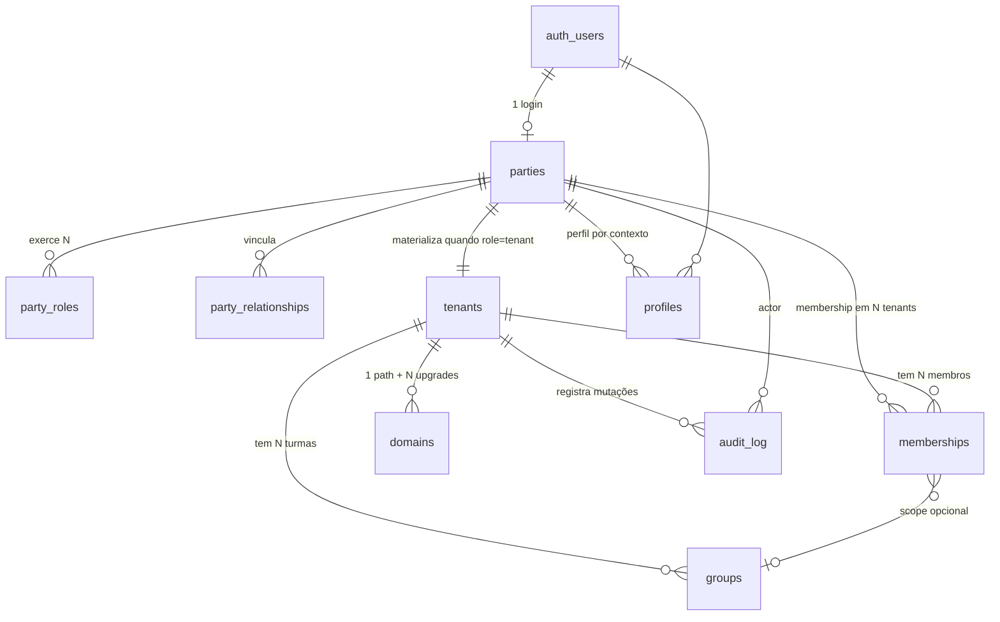

# Blueprint 01 — Schema completo previsto (~56 tabelas)

> Última atualização: 2026-06-12 · Synced from ADR-0001 v1.0 · foundation.md v1.0
> Status: Active. 10 tabelas feitas em S0, resto previsto pra S4-S7+ JIT.
> Visualização interativa: `schema.dbml` raiz → cole em [dbdiagram.io](https://dbdiagram.io/).

## Status legend

- ✅ **feita** — já existe no Supabase (S0)
- ⏳ **S1-S6** — sprint cravado pra criação
- 🔮 **JIT** — só quando gatilho real surgir
- 🔮 **Fase 2+** — pós-S7 (treino/wearable/agenda/marketplace)

## Diagrama entidades core (S0 — feitas)

## Categorias

### 1. Identidade & multi-tenant ✅ FEITAS S0

| Tabela                | O que guarda                                         | Status | Sprint | Notas                                                                                                                                                                                         |
| --------------------- | ---------------------------------------------------- | ------ | ------ | --------------------------------------------------------------------------------------------------------------------------------------------------------------------------------------------- |
| `parties`             | Pessoa OR organização (1 login = 1 party)            | ✅     | S0     | `kind enum(person\|organization)`, `auth_user_id`, `document`, `contacts jsonb`                                                                                                               |
| `party_roles`         | Papéis que uma party exerce com escopo + vigência    | ✅     | S0     | `role_type enum (tenant\|sponsor_*\|supplier_*\|service_provider\|event_organizer)`, `scope_kind enum(platform\|tenant\|event)`, `scope_id`, `status enum(pending\|active\|suspended\|ended)` |
| `party_relationships` | Vínculos entre 2 parties (sponsorship, partner, b2b) | ✅     | S0     | `kind enum`, `terms jsonb` (commission_pct/monthly_rent/etc — JSONB porque forma varia por kind)                                                                                              |
| `tenants`             | Assessoria/run club/coach pagante (materializado)    | ✅     | S0     | `party_id` FK, `slug` único, `display_label`, `theme_tokens jsonb`, `settings jsonb`                                                                                                          |
| `profiles`            | Perfil de pessoa em contexto                         | ✅     | S0     | `a11y_prefs jsonb` (reduce-motion, font-scale, contrast)                                                                                                                                      |
| `groups`              | Turmas/níveis/cidades pra data scope                 | ✅     | S0     | Pra coach só ver seu grupo                                                                                                                                                                    |
| `memberships`         | Papel da party DENTRO de tenant                      | ✅     | S0     | `role enum 7 valores`, `position_label text` (livre), `permissions jsonb`, `group_id`                                                                                                         |
| `domains`             | URL mode: path / subdomain / cname                   | ✅     | S0     | Path default. Subdomain/CNAME = entitlement Apoiador/Membro                                                                                                                                   |
| `slug_blocklist`      | Slugs reservados                                     | ✅     | S0     | 23 entries seed (admin, app, retake, etc)                                                                                                                                                     |
| `audit_log`           | Append-only de toda mutação importante               | ✅     | S0     | `actor_kind` (user\|ai\|system), `payload jsonb`                                                                                                                                              |

### 2. Site público + conteúdo do tenant (S4)

| Tabela                  | O que guarda                                        | Status | Sprint | Notas                                                                                  |
| ----------------------- | --------------------------------------------------- | ------ | ------ | -------------------------------------------------------------------------------------- |
| `tenant_themes`         | Tokens do tema (input) versionado                   | ⏳     | S4     | `tokens jsonb` snapshot atual (JSONB porque forma varia por tenant)                    |
| `tenant_theme_versions` | Snapshot imutável + derived cacheado                | ⏳     | S4     | `tokens jsonb`, `derived jsonb` cache, `contrast_report jsonb` APCA                    |
| `pages`                 | Site público do tenant                              | ⏳     | S4     | `slug`, `status enum(draft\|published)`, `current_version_id` FK                       |
| `page_versions`         | Versão imutável da página                           | ⏳     | S4     | **`content jsonb`** = `{style_preset, blocks[], slots}` — composição vibe-coding-ready |
| `coaches`               | Treinadores apresentados publicamente               | ⏳     | S4     | Normalized — query frequente (filtro, listagem)                                        |
| `plans_offered`         | Planos que o tenant vende                           | ⏳     | S4     | NÃO confundir com `plans` da plataforma. Normalized — query agg                        |
| `services`              | Serviços oferecidos (training/assessment/etc)       | ⏳     | S4     | `kind enum (corrida-specific)`, normalized                                             |
| `testimonials`          | Depoimentos de atletas                              | ⏳     | S4     | Normalized — listagem                                                                  |
| `gallery`               | Galeria de fotos                                    | ⏳     | S4     | Normalized — ordenação                                                                 |
| `tenant_locations`      | Locais de atendimento (presencial cidades + online) | ⏳     | S4     | Usado por captação form pra dropdown                                                   |

### 3. Captação + CRM (S4-S5)

| Tabela                    | O que guarda                              | Status | Sprint | Notas                                                       |
| ------------------------- | ----------------------------------------- | ------ | ------ | ----------------------------------------------------------- |
| `leads`                   | Leads captados                            | ⏳     | S4     | Campos fixos + `custom_answers jsonb`                       |
| `form_submission_outbox`  | Outbox pattern pra fan-out                | ⏳     | S4-S5  | Régua de comunicação                                        |
| `tenant_forms`            | Forms futuros (avaliação/sugestão/custom) | 🔮 JIT | —      | `kind enum`, `fixed_fields jsonb`, `custom_questions jsonb` |
| `tenant_form_submissions` | Respostas                                 | 🔮 JIT | —      | `answers jsonb`                                             |

### 4. Comunicação (S5)

| Tabela                    | O que guarda                              | Status | Sprint | Notas                                                       |
| ------------------------- | ----------------------------------------- | ------ | ------ | ----------------------------------------------------------- |
| `communication_templates` | Templates editáveis por tenant            | ⏳     | S5     | React Email JSX armazenado como text + i18n jsonb           |
| `communication_log`       | Histórico por contato                     | ⏳     | S5     | `payload jsonb` (varia por kind)                            |
| `communication_rules`     | Régua automática                          | ⏳     | S5     | `trigger enum`, `template_id`, `delay_minutes`, `is_active` |
| `notifications`           | In-app (Realtime)                         | 🔮 JIT | —      | `payload jsonb`                                             |
| `webhook_deliveries`      | Retry de webhooks (gateway, melhor envio) | 🔮 JIT | —      | `payload jsonb`, retry tracking                             |

### 5. Eventos & provas (S5)

| Tabela                | O que guarda                 | Status | Sprint | Notas                                                                     |
| --------------------- | ---------------------------- | ------ | ------ | ------------------------------------------------------------------------- |
| `events`              | Prova/treinão/clínica/viagem | ⏳     | S5     | `type enum`, `source enum(managed\|imported\|suggested)`, `verified bool` |
| `event_lots`          | Lotes do organizador         | ⏳     | S5     | `window jsonb` (janela varia por lote)                                    |
| `event_moderation`    | Fila anti-fake               | ⏳     | S5     | `reports int`, `dupe_of`, `domain_ok bool`, `cnpj_ok bool`                |
| `event_registrations` | Inscritos                    | 🔮 JIT | —      | Só quando houver checkout próprio                                         |

### 6. IA (multi-agent + tools + approval gate) S4

| Tabela                     | O que guarda                       | Status | Sprint | Notas                                                                                     |
| -------------------------- | ---------------------------------- | ------ | ------ | ----------------------------------------------------------------------------------------- |
| `chats`                    | Thread por agent_kind              | ⏳     | S4     | `agent_kind enum (general dia 1, +N JIT)`, `scope_id NULL`                                |
| `messages`                 | Linear por thread                  | ⏳     | S4     | `payload jsonb` (varia por message kind)                                                  |
| `ai_tools`                 | Registry SSOT de tools disponíveis | ⏳     | S4     | `name`, `agent_kinds text[]`, `schema jsonb`, `requires_approval bool`, `risk_level enum` |
| `engine_plans`             | Approval gate genérico             | ⏳     | S4     | `plan jsonb`, `status enum(pending\|approved\|rejected\|applied)`                         |
| `pipeline_runs`            | State machine de pipeline IA       | ⏳     | S4     | `state jsonb`, `current_stage enum`                                                       |
| `ai_prompts` + `_versions` | Prompts versionado imutável        | ⏳     | S4     | `body text`, `metadata jsonb`                                                             |
| `ai_generations`           | Log de cada execução               | ⏳     | S4     | `params jsonb`, `result jsonb`, `tokens_used int`                                         |
| `ai_usage_monthly`         | Cota/billing por tenant            | ⏳     | S4     | Normalized — agg pra billing                                                              |

### 7. Planos & billing (3 audiences) S6

| Tabela          | O que guarda                             | Status | Sprint | Notas                                                                     |
| --------------- | ---------------------------------------- | ------ | ------ | ------------------------------------------------------------------------- |
| `plans`         | 3 audiences: tenant / sponsor / supplier | ⏳     | S6     | `audience enum`, `code`, `contract enum(none\|monthly\|annual\|biennial)` |
| `prices`        | Preço por recorrência + scope            | ⏳     | S6     | `amount_cents NULL` (NULL = quote_required), `meta jsonb (per_state etc)` |
| `features`      | Catálogo de keys de feature              | ⏳     | S6     | Lookup table                                                              |
| `plan_features` | Mapeamento plano → feature → limite      | ⏳     | S6     | `value jsonb` (limit/flag varia por feature)                              |
| `subscriptions` | Assinatura ativa                         | ⏳     | S6     | `gateway enum`, `gateway_ref`, `status enum`                              |
| `feature_usage` | Cota com reset                           | ⏳     | S6     | Normalized — bench frequente vs limit                                     |

### 8. Sponsors / Suppliers / Cupons S6+JIT

| Tabela               | O que guarda                  | Status | Sprint | Notas                                                                  |
| -------------------- | ----------------------------- | ------ | ------ | ---------------------------------------------------------------------- |
| `sponsorships`       | Contratação de visibilidade   | ⏳     | S6     | `tier enum`, `scope_states text[]`, `assets jsonb` (logo/banner varia) |
| `brand_placements`   | Onde marca aparece + métricas | ⏳     | S6     | `surface enum`, `position int`, métricas agregadas                     |
| `suppliers`          | Perfil B2B vitrine            | ⏳     | S6     | `categories text[]`, `verified bool`, `profile jsonb`                  |
| `coupons`            | Cupons retake via afiliados   | 🔮 JIT | —      | `affiliate_program enum`, `commission jsonb`                           |
| `coupon_redemptions` | Rastreio cupom                | 🔮 JIT | —      | `utm jsonb`, `postback jsonb`                                          |

### 9. Recursos físicos + Parcerias + Comissões (JIT — Trinks-style)

| Tabela              | O que guarda                             | Status | Sprint | Notas                                                                                                    |
| ------------------- | ---------------------------------------- | ------ | ------ | -------------------------------------------------------------------------------------------------------- |
| `resources`         | Local/sala/espaço/equipamento            | 🔮 JIT | —      | `kind enum(location\|room\|space\|equipment)`, `ownership enum(owned\|rented\|partner)`, `address jsonb` |
| `service_providers` | Qual member/parceiro presta qual serviço | 🔮 JIT | —      | `commission_pct OR commission_fixed_cents`                                                               |
| `commission_rules`  | % ou valor fixo por (service, provider)  | 🔮 JIT | —      | `scope`, `percent OR amount`, `waterfall jsonb`                                                          |
| `commission_ledger` | Entries automáticas pós-pagamento        | 🔮 JIT | —      | `status enum(pending\|paid)`, `amount_cents`                                                             |
| `resource_bookings` | Reservas com cota por plano              | 🔮 JIT | —      | `slot`, `athlete_id`                                                                                     |

### 10. Roadmap público + voto + changelog (JIT — build in public)

| Tabela              | O que guarda             | Status | Sprint | Notas                                                                                |
| ------------------- | ------------------------ | ------ | ------ | ------------------------------------------------------------------------------------ |
| `roadmap_items`     | Items com horizonte      | 🔮 JIT | —      | `horizon enum(now\|next\|later)`, `status enum(idea\|planned\|in_progress\|shipped)` |
| `feature_votes`     | Voto Apoiador+Membro     | 🔮 JIT | —      | `weight int` (varia por plano)                                                       |
| `changelog_entries` | Liga shipped → changelog | 🔮 JIT | —      | `roadmap_item_id NULL`, `by_community bool`                                          |

### 11. Núcleo de treino de corrida — O FOSSO (Fase 2+)

| Tabela                    | O que guarda                              | Status     | Sprint | Notas                                                                       |
| ------------------------- | ----------------------------------------- | ---------- | ------ | --------------------------------------------------------------------------- |
| `athletes`                | Atleta do tenant                          | 🔮 Fase 2  | —      | `status enum`, `level`, `objective`, `group_id`                             |
| `anamnese`                | Saúde + lesões + restrições               | 🔮 Fase 2  | —      | **`health jsonb`** (forma varia por atleta) + `running_history jsonb`       |
| `assessments`             | Avaliações ao longo do tempo              | 🔮 Fase 2  | —      | `kind` (VO2/FC/peso/teste), `value jsonb`                                   |
| `athlete_thresholds`      | Pace + FC limiar + zonas                  | 🔮 Fase 2  | —      | `pace_threshold`, `hr_threshold`, `zones jsonb` (calculadas)                |
| `macrocycles`             | Temporada (objetivo + prova-alvo)         | 🔮 Fase 2  | —      | `target_event_id NULL`                                                      |
| `mesocycles`              | Blocos (base/build/peak/transition)       | 🔮 Fase 2  | —      | `focus enum`, `target_load jsonb`                                           |
| `microcycles`             | Semanas de treino                         | 🔮 Fase 2  | —      | `target_load jsonb`                                                         |
| `sessions`                | Sessão do dia                             | 🔮 Fase 2  | —      | `modality enum(run\|...)` (corrida agora)                                   |
| `training_day_items`      | Treino segmentado                         | 🔮 Fase 2  | —      | `library_item_id FK OR inline jsonb`, `target jsonb` (pace\|hr\|power\|rpe) |
| `training_plan_templates` | Plano reutilizável                        | 🔮 Fase 2  | —      | Estrutura espelhada com library_item refs                                   |
| `workout_executions`      | Loop prescrito × executado                | 🔮 Fase 2  | —      | `executed jsonb`, `compliance enum(green\|yellow\|red)`                     |
| `wearable_connections`    | Tokens Garmin/Strava/Polar/Coros cifrados | 🔮 Fase 2  | —      | `tokens jsonb cifrado`                                                      |
| `wearable_activities`     | Atividade crua sincronizada               | 🔮 Fase 2  | —      | `raw jsonb`, processada vs threshold                                        |
| `load_metrics`            | TSS/CTL/ATL/TSB (carga + PMC)             | 🔮 Fase 2+ | —      | Normalized — chart frequente                                                |

### 12. Agenda & Conteúdo (Fase 2+)

| Tabela               | O que guarda                                                     | Status     | Sprint | Notas                                                        |
| -------------------- | ---------------------------------------------------------------- | ---------- | ------ | ------------------------------------------------------------ |
| `classes`            | Turmas/aulas recorrentes                                         | 🔮 Fase 2  | —      | `mode enum(presencial\|online\|hibrido)`, `recurrence jsonb` |
| `class_sessions`     | Ocorrência data/hora                                             | 🔮 Fase 2  | —      | Normalized — query por data                                  |
| `attendance`         | Check-in atleta                                                  | 🔮 Fase 2  | —      | Normalized                                                   |
| `library_items`      | Catálogo polimorfico (workout_segment\|content\|exercise\|block) | 🔮 Fase 2  | —      | `payload jsonb` (forma varia por kind)                       |
| `programs`           | Curso/área de conteúdo                                           | 🔮 Fase 2+ | —      | `sale_model enum(perpetual\|cohort)`                         |
| `modules`            | Módulos do programa                                              | 🔮 Fase 2+ | —      | Normalized                                                   |
| `module_items`       | Aulas (vídeo/live/PDF/quiz)                                      | 🔮 Fase 2+ | —      | `unlock_rules jsonb`                                         |
| `component_progress` | Progresso atleta no programa                                     | 🔮 Fase 2+ | —      | `progress jsonb`                                             |
| `certificates`       | Certificados ao concluir                                         | 🔮 Fase 2+ | —      | Normalized                                                   |

### 13. Marketplace (Fase 4)

| Tabela             | O que guarda                           | Status    | Sprint | Notas                                                                   |
| ------------------ | -------------------------------------- | --------- | ------ | ----------------------------------------------------------------------- |
| `products`         | Físico/dropship/digital/serviço/evento | 🔮 Fase 4 | —      | `kind enum`, `images jsonb`                                             |
| `product_variants` | Tamanho/cor/sabor + SKU                | 🔮 Fase 4 | —      | `attributes jsonb` (varia por produto), `price_cents`, `stock int NULL` |
| `orders`           | Pedido                                 | 🔮 Fase 4 | —      | `totals jsonb`, `split jsonb` (3 vias)                                  |
| `order_items`      | Items do pedido                        | 🔮 Fase 4 | —      | Normalized — agg pra reporting                                          |

### 14. Auditoria & LGPD (suplementos)

| Tabela                   | O que guarda                                         | Status | Sprint | Notas                                           |
| ------------------------ | ---------------------------------------------------- | ------ | ------ | ----------------------------------------------- |
| `content_audit_log`      | Mutações em conteúdo (page_versions, theme_versions) | 🔮 JIT | —      | Mais granular que audit_log padrão              |
| `consents`               | Consentimento LGPD                                   | 🔮 JIT | —      | `granted_at`, `purpose enum`, `revoked_at NULL` |
| `data_export_requests`   | LGPD direito acesso                                  | 🔮 JIT | —      | `status enum(pending\|ready\|delivered)`        |
| `data_deletion_requests` | LGPD direito apagamento                              | 🔮 JIT | —      | Idem                                            |

## Total = 56 tabelas previstas

- ✅ **10 já feitas (S0)** — identidade core
- ⏳ **22 vêm nos sprints S4-S6** — site + leads + IA + planos + comunicação + eventos
- 🔮 **13 JIT (sob demanda real)** — recursos físicos + parcerias + sponsors específicos + roadmap + LGPD
- 🔮 **11 fase 2+** — treino + wearable + agenda + programs + marketplace

## Princípios cravados ao desenhar

- **JSONB vs normalized**: passar pelo framework cravado em `.claude/rules/jsonb-vs-normalized.md`
- **RLS por tenant_id** em toda tabela do produto
- **`'server-only'`** em todo `lib/data/*` que lê dessas tabelas
- **Migrations via MCP** (nunca `.sql` manual em `supabase/migrations/`)
- **Splinter security advisor zero warnings** pós cada migration
- **Versionamento imutável** quando faz sentido (pages, themes, prompts, library_items): tabela `_versions` append-only + trigger anti-UPDATE/DELETE + ponteiro `current_version_id` no pai
- **Soft-delete** (`archived_at timestamptz NULL`) em tabelas com histórico — nunca DELETE físico
- **Updated_at trigger** genérico em toda tabela

## Quando criar tabela nova

1. Confirmar não duplica outra existente
2. Passar pelo framework JSONB vs normalized
3. Adicionar entrada nesta tabela com status + sprint
4. Atualizar `schema.dbml` raiz
5. Gerar migration via MCP `apply_migration` (nome `NNNN_descricao`)
6. Splinter advisor zero warnings
7. Atualizar `FOUNDER.md` se for tabela core (parte de S1-S6)

## Visualização

`schema.dbml` raiz contém DBML formal. Visualize gratuitamente:

- [dbdiagram.io](https://dbdiagram.io/) — cole o conteúdo + diagram gerado automático
- VSCode extension "DBML Live Preview" — preview local
- CLI `dbml-renderer` — gera SVG: `npx -y @softwaretechnik/dbml-renderer -i schema.dbml -o schema.svg`
